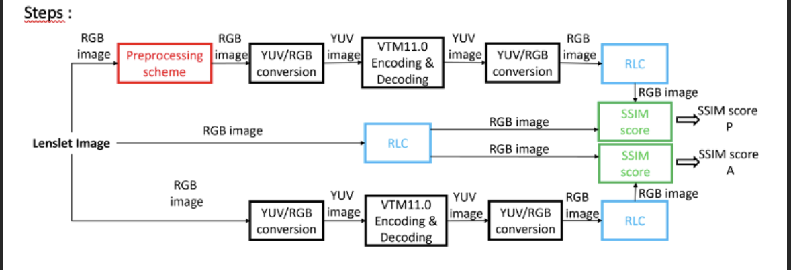

# Pipeline for the processing of lenslet images

The pipeline consists of the following steps:



To run the pipeline, just specify the config file. A template config file is provided at ```cfg_templates/pipeline_config_template.cfg```.
An output directory is generated at the begining.
After the 3 lines have generated the multiview images, the psnr score is computed and written in a .txt file.

**Example :**

```python3 main.py dataset/Ornito/pipeline_config_Ornito.cfg```

## Tools used

### Pre-processing

$\implies$ ***LL_clean_preprocessing.py*** : a python script used to preprocess the lenslet image

**Arguments :**

- -i = the input file
- -cfg = the general pipeline config file
- -o = outputname

The script can be runned with hard-coded parameters with just ```python3 LL_clean_preprocessing.py```. This will bypass the use of the config file (a smaller config_dico will still be created).

**Example :**

```python3 ./LL_clean_preprocessing.py -i dataset/Ornito/Ornito2048x2048.png -cfg cfg_files/pipeline_config_Ornito.cfg -o dataset/Ornito/output/pre_processing_line/Ornito2048x204811Ring3Bord1Sig2CutOff250_TestReBlur.png```

### PSNR score

$\implies$ ***psnr_recon.py*** : a script used to compute the average psnr of the subaperture views generated by RLC

A QP values are hard-coded in the file. The script goes trough every directory named f"qp{QP}/" inside the given rlc_output directories and outputs the psnr value in a text file.

**Arguments :**

- -r = the path to the rlc reference multiview folder
- -i = the path of the multiview folder that we want to compare
- -o = the output path name
- -name = the name of the written file

**Example :**

```python3 psnr_recon.py -ref ./dataset/Ornito/rlc_ref/ -i ./dataset/Ornito/rlc_preproc/ -o ./output.txt ./cfg_files/pipeline_config_Ornito.cfg```

Here, with QP = [50, 13] hard-coded, it will compare the multiview of ```/dataset/Ornito/rlc_ref/qp50``` and ```./dataset/Ornito/rlc_preproc/qp50```
then ```/dataset/Ornito/rlc_ref/qp13``` and ```./dataset/Ornito/rlc_preproc/qp13```.

### ffmpeg

ffmpeg is used to convert the rgb images to yuv420p and back to rgb.

### VTM

EncoderApp is used to compress and decompress the image.
**Important to note** : VTM takes as input the yuv420p pixel format and outputs yuv420p10le. This is important to note when using ffmpeg.

### RLC

RLC takes a rgb lenslet image and outputs the multiview images.

The RLC config file is generated on the go based on the ```RLC_config_template.cfg``` file. Some parameters will be modified according to the general **pipeline** config file (they are marked with an underscore in the template file).
These are the parameters :

- Calibration_xml
- RawImage_Path
- Output_Path
- height
- width
- TODO start_frame, end_frame

To change the other parameters, directly change the values in the template file, as they will be used to generate the correct RLC config file. 
